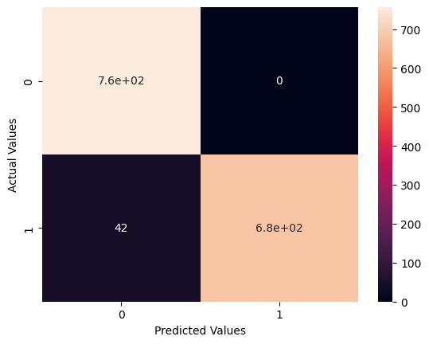

# PRODUCT REVIEW SENTIMENT ANALYSIS
The Product Review Sentiment Analysis project aims to evaluate and categorize customer sentiments from product reviews on e-commerce platforms like Amazon. Utilizing a dataset of 4000 customer reviews, the project employs natural language processing (NLP) techniques and machine learning algorithms to classify the sentiment of each review as positive, negative, or neutral. Achieving an impressive 97.01% accuracy on test data, the model effectively balances bias and variance, ensuring reliable sentiment analysis. This tool is instrumental for businesses to understand customer feedback, improve products, and enhance customer satisfaction.

# MODEL PERFORMANCE

| Model | Train Accuracy | Test Accuracy | Cross-Validation Score |
|-------|----------------|---------------|------------------------|
| Logistic Regression | 94.71% | 93.50% | 93.04% |
| Support Vector Classifier | 97.35% | 97.02% | 96.82% |
| Decision Tree Classifier | 97.40% | 92.82% | 93.46% |
| Random Forest Classifier | 97.40% | 95.93% | 95.38% |
| AdaBoost Classifier | 97.40% | 95.19% | 94.83% |
| Bagging Classifier | 97.40% | 93.83% | 93.62% |
| Gradient Boosting Classifier | 97.40% | 94.44% | 94.39% |
| Multinomial Naive Bayes | 91.88% | 90.24% | 90.05% |

These results demonstrate the performance of various models on the sentiment analysis dataset. The Support Vector Classifier (SVC) performed the best overall with high accuracy on both training and testing data, and a strong cross-validation score.

# RESULTS
Developed a sentiment analysis model utilizing an Amazon
product review dataset, achieving 97.35% accuracy on training
data and 97.01% accuracy on test data, with a 96.40% mean
cross‐validation score. 

#### Confusion Matrix

 

#### Classification Report 
## Classification Report

| Class | Precision | Recall | F1-Score | Support |
|-------|-----------|--------|----------|---------|
| 0     | 0.95      | 1.00   | 0.97     | 756     |
| 1     | 1.00      | 0.94   | 0.97     | 720     |
| **Accuracy** |       |        | 0.97     | 1476    |
| **Macro Avg** | 0.97      | 0.97   | 0.97     | 1476    |
| **Weighted Avg** | 0.97      | 0.97   | 0.97     | 1476    |

